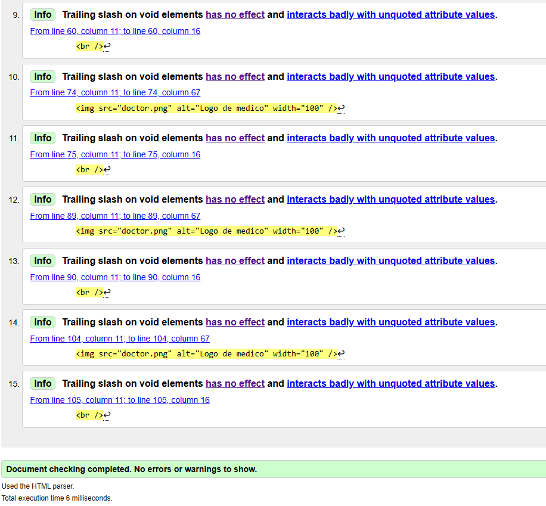
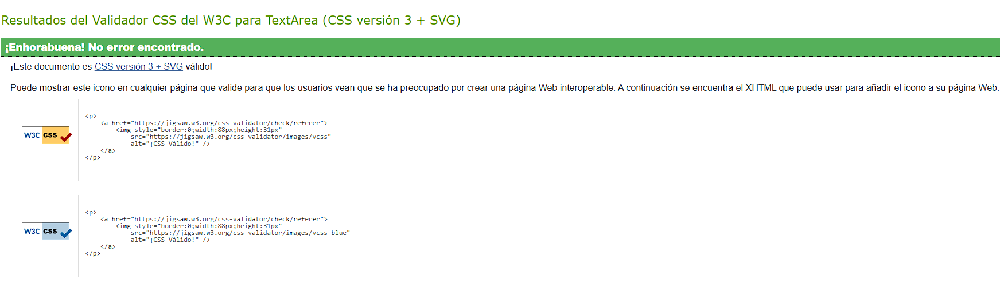

# Laboratorio 2: Hojas de estilo mediante CSS

## Validaciones

### Validación HTML

- Herramienta: https://validator.w3.org/
- Resultado: Sin errores / Con 0 advertencias
- Captura:
  

### Validación CSS

- Herramienta: https://jigsaw.w3.org/css-validator/
- Resultado: Sin errores / Con 0 advertencias
- Captura:
  
